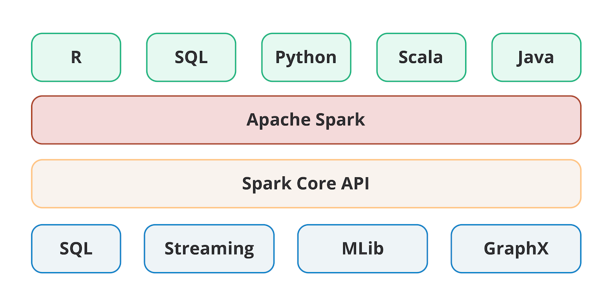
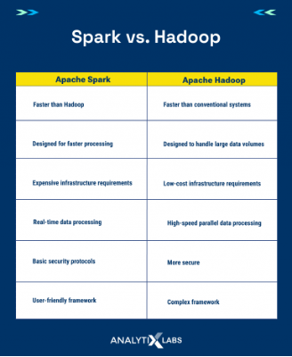

# Week 11 Overview
This week, we’ll explore how distributed data and compute systems handle big data processing efficiently. We'll examine architectural patterns and challenges, then dive into the Hadoop ecosystem and data processing with MapReduce and Spark—key technologies that enable distributed data storage, processing, and optimization. 

## Learning Objectives:
At the end of this week, you will be able to:
- Review the fundamentals of distributed data and distributed compute 
- Recognize the Hadoop ecosystem  
- Describe MapReduce processing 
- Understand the Spark ecosystem 

## Topic Overview: Review the fundamentals of distributed data and distributed compute 
In this topic, we will recall the fundamentals of distributed data and distributed computing. We will explore the challenges that arise in distributed data and compute systems and review architectural patterns used for distributed data storage and processing. Additionally, we will discuss real-world examples of distributed data and compute systems to understand their practical applications. 

### Learning Objectives 
- Recall the fundamentals of distributed data and distributed compute 

### 1.1 Lesson: Challenges in Distributed Data and Compute Systems
Distributed systems bring immense power in processing and storing large datasets — the foundation of what we now call “big data” — yet they also introduce several complexities. Several leading vendors and technologies are built on distributed systems, including Microsoft Fabric, Apache Hadoop, Apache Spark, Databricks, and many more. This is currently the leading approach to big data processing in the industry. 

#### Network Latency and Communication Overhead
One major challenge is network latency and communication overhead: When data is spread across multiple nodes, synchronizing and transferring information can slow down overall system performance, especially in real-time applications. Moreover, ensuring data consistency across a distributed environment is a constant balancing act. The need to reconcile concurrent updates across nodes often forces developers to choose between strong and eventual consistency models, with each decision impacting performance and accuracy. 

#### Resource Management and Load Balancing 
Another difficulty lies in resource management and load balancing. With tasks distributed across a cluster, uneven data distribution can create hotspots, where some nodes become overburdened while others remain underutilized. This imbalance not only affects processing speeds but can also lead to inefficient energy usage and higher operational costs. Additionally, fault tolerance mechanisms, although essential for system resilience, introduce extra layers of complexity, requiring sophisticated replication and recovery strategies to maintain seamless operations even when some components fail. 

#### Security and Reliability
Security and reliability are additional challenges. Distributed systems must manage access control and encryption consistently across all nodes, which becomes more complex as the system scales. In such environments, ensuring that a single point of failure does not compromise data integrity requires careful planning and robust error-handling strategies. These challenges, while significant, also drive innovation in distributed architectures and foster the development of more resilient systems. 

#### Required Resources
The following resources are required for your learning this week. Make sure you review everything linked below, as you may be tested on the concepts in an upcoming Knowledge Check or Quiz. 

**Reading | Taylor, C. (2019, June 10). Memory vs storage: What are the differences? Enterprise Storage Forum**

This article provides a clear comparison between memory and storage, explaining their distinct roles in computing systems. It discusses how memory — typically random access memory (RAM) — offers high-speed, temporary data access, while storage — such as solid-state drives (SSDs) and hard disk drives (HDDs) — provides long-term, persistent data retention. Focus on the details of the differences in performance, capacity, and cost between these two components, as well as the examples illustrating their practical applications. Understanding these differences is crucial for designing efficient systems and optimizing both hardware and software performance — and, as we’ll see soon, costs associated with processing big data. 

**Reading | Ahmadian, S., Salkhordeh, R., Mutlu, O., & Asadi, H. (2021). ETICA: Efficient two-level I/O caching architecture for virtualized platforms. IEEE Transactions on Parallel and Distributed Systems, 32(3), 566–582.**

This chart demonstrates the costs versus speeds associated with various storage types. The term IOPS stands for input/output per second and is a standard measure for performance throughput while storing and processing data. Note the exponentially higher costs for DDR and L2 Cache, but at similarly exponential speeds. This provides a basis for the comparisons of Hadoop and Spark where we measure cost versus performance.

### 1.2 Lesson: Architectural Patterns in Distributed Data
There are several architectural patterns that form the backbone of distributed data storage and processing, each tailored to different needs.  

#### Lambda Architecture
The Lambda Architecture combines batch and real-time processing, allowing organizations to derive both historical insights and immediate analytics. This dual-layer approach is especially beneficial in environments where data velocity is as critical as data volume. In contrast, the Kappa Architecture simplifies the system by focusing solely on stream processing, making it ideal for scenarios where near-instant data processing is paramount. 

#### Data Lake Architecture 
Another common design is the Data Lake Architecture, which enables organizations to store raw data in its native format. This model provides immense flexibility, allowing for varied data types (structured, semi-structured, unstructured) to be stored without immediate transformation. It also supports advanced analytics, as data can be later processed and refined according to specific business needs. Complementing these are modern distributed structured query language (SQL) and not only SQL (NoSQL) approaches that incorporate features like sharding and replication to optimize both storage efficiency and query performance. 

A key takeaway from these patterns is the trade-off between complexity and performance. While architectures like Lambda offer comprehensive analytical capabilities, they can be more challenging to implement and maintain. In contrast, simpler architectures like Kappa may offer faster development cycles but might lack some depth in historical data processing. You should consider how these patterns align with specific organizational needs and the nature of the data being processed.

### 1.3 Lesson: Examples of Distributed Data and Compute Systems
Distributed systems are at the heart of many modern applications, making their real-world applications particularly compelling. For example, major cloud providers like Amazon Web Services (AWS), Google Cloud, and Microsoft Azure leverage distributed architectures to offer scalable storage and compute resources across global networks. These platforms use distributed file systems and computing clusters to handle everything from web hosting to real-time analytics, ensuring that applications remain available and responsive even under heavy load. 

In the realm of social media, companies like Facebook and X (formerly Twitter) use distributed data systems to manage the enormous volume of user interactions, posts, and media content. Their architectures are designed to handle millions of concurrent users, delivering real-time feeds and recommendations by dynamically distributing and processing data across numerous servers. Similarly, financial institutions utilize distributed computing for high-frequency trading and risk management, where milliseconds matter, and vast streams of transaction data must be processed without delay. 

Additionally, industries like telecommunications and e-commerce also rely on distributed systems. Telecommunications companies manage call detail records across distributed networks to optimize service quality, while e-commerce platforms use distributed architectures to handle inventory management, customer transactions, and personalized marketing campaigns at scale. These examples underscore how distributed data and compute systems enable organizations to manage massive, dynamic datasets in real-world, high-demand environments. 

### 1.4 Knowledge Check: Distributed Data and Distributed Compute Review
1. A multinational corporation deploys a distributed computing system to process large-scale data analytics across several global data centers. Which challenge is most likely to impact the system’s performance?
- Correct: Network latency and communication overhead
- In distributed systems, data and compute tasks are spread over multiple nodes. This geographic and network separation can lead to delays due to latency and increased communication overhead between nodes.

2. An organization stores its data across a distributed database system to ensure high availability. What key advantage does distributed data storage provide compared to centralized storage?
- Correct: Enhanced fault tolerance through redundancy 
- Distributed storage systems replicate data across multiple nodes, ensuring that if one node fails, the data remains accessible from others, which improves overall fault tolerance.

3. In a distributed computing environment, a system administrator notices that some nodes are frequently overloaded while others remain underutilized. What is this issue most commonly called?
- Correct: Load imbalance
- Load imbalance occurs when the distribution of work among nodes is uneven, causing some nodes to be overburdened, while others have spare capacity. This can lead to inefficient processing and longer overall task completion times. 

4. A tech company utilizes a distributed compute system to run parallel processing jobs for real-time analytics. Which of the following strategies is most effective for ensuring that tasks are evenly distributed across the cluster? 
- Correct: Implementing an advanced load balancing mechanism
- Advanced load balancing algorithms help distribute tasks evenly across nodes in a distributed system, ensuring that resources are optimally utilized and that no single node becomes a bottleneck.

## Topic 2: Hadoop Ecosystem
In this topic, we will explore the Hadoop ecosystem, focusing on its core components for distributed data storage and processing. We will examine HDFS and its role in managing large-scale data, followed by an introduction to YARN, which handles resource management and job scheduling. Finally, we will discuss key Hadoop tools and extensions, such as Hive and Spark, that enhance data processing capabilities. 

### 2.1 Lesson Hadoop Ecosystem
Let's dive into the Hadoop ecosystem — a powerful suite of tools designed to handle big data efficiently. While Hadoop itself provides the foundation for distributed storage and processing, its ecosystem extends its capabilities, making it one of the most comprehensive solutions for managing large-scale data. 

In the following video, we’ll explore the essential components of the Hadoop ecosystem, including HDFS for storage, YARN for resource management, and MapReduce for batch processing. We’ll also introduce key extensions that enhance data ingestion, analysis, and security.

This video explores the main components of the Hadoop Ecosystem at a high level. Each technology is much more complex in practice. That is beyond the reach of this course (you will not be expected to learn Hadoop in this class) but is worth being aware of, as many open-source capabilities were developed to work with various data compute needs that arose. 

The Hadoop ecosystem is a robust framework designed to process and store massive datasets across distributed environments. At its core, it comprises several interrelated components that work together to provide scalable, fault-tolerant, and cost-effective big data solutions. The primary components include HDFS for storage and MapReduce for batch processing. These form the backbone of Hadoop’s data processing capabilities and ensure that data is reliably stored and processed across large clusters. 

In addition to HDFS and MapReduce, the ecosystem includes a suite of tools that extend its functionality. For instance, Hive and Pig provide higher-level abstractions for querying and transforming data, making it easier to work with large datasets without deep programming expertise. Other tools, like HBase for real-time read/write access and Sqoop for transferring data between Hadoop and relational databases, further enhance the versatility of the platform. This modularity allows organizations to tailor Hadoop to a variety of use cases, from batch processing to real-time analytics. 

Understanding the core components that power the Hadoop ecosystem, as well as the supporting tools that facilitate data ingestion, processing, and analysis, is essential. Recognizing how these components interact is key to grasping the overall architecture and realizing the practical benefits of Hadoop in large-scale data environments.

#### Required Resources
The following resources are required for your learning this week. Make sure you review everything linked below, as you may be tested on the concepts in an upcoming Knowledge Check or Quiz. 

**Reading | Kostic, N. (2024, February 14). What is Hadoop and what is it used for? PhoenixNAP.**

This article provides a comprehensive overview of Hadoop, outlining its evolution, key components, and role in processing large-scale datasets through distributed computing. It is particularly relevant for those seeking to understand how Hadoop facilitates scalable, fault-tolerant data storage and processing using frameworks like HDFS and MapReduce. As you read, focus on sections that explain Hadoop’s core architecture, its data storage mechanisms with HDFS, and the MapReduce paradigm for distributed processing, as these concepts form the foundation of modern big data systems.

### 2.2 Lesson: Hadoop Distributed Filesystem (HDFS) and Resource Management (YARN)

Hadoop Distributed File System (HDFS)
HDFS is the foundation of the Hadoop ecosystem, engineered to store vast amounts of data reliably across multiple nodes. It is designed with fault tolerance in mind, automatically replicating data across several nodes to ensure that no single failure results in data loss. This distributed storage approach allows HDFS to scale horizontally, making it possible to manage petabytes of data with relative ease. 

The architecture of HDFS is based on a HeadNode/WorkerNode model, where the NameNode manages the filesystem’s namespace and metadata, while DataNodes handle the actual storage of data blocks. This separation of duties allows HDFS to provide efficient data access and high throughput for batch processing tasks. Additionally, the design of HDFS supports data locality — processing data on the same nodes where it is stored — which significantly enhances performance by reducing network congestion. 

**Note: The term HeadNode/WorkerNode is most often referred to as the master-slave model in industry. For the purposes of this program, we will use the term HeadNode/WorkerNode when discussing HDFS and other distributed architectures.** 

**Resource Management in Hadoop: YARN**
YARN is a vital component of the Hadoop ecosystem responsible for managing cluster resources and scheduling tasks. Acting as the central nervous system, YARN coordinates the allocation of computing resources among various applications and services running on a Hadoop cluster. Its role is to ensure that data processing jobs, whether they are MapReduce tasks or interactive queries, have the resources they need to run efficiently without overloading any single node. 

YARN operates by separating the resource management and job scheduling functions. The ResourceManager oversees the allocation of resources across the cluster, while the NodeManagers on individual nodes report resource usage and enforce resource limits. This division allows YARN to effectively manage a diverse range of workloads and ensure scalability and fault tolerance in a distributed environment. It also supports multi-tenancy, enabling multiple users and applications to run concurrently on the same cluster while maintaining fair resource distribution.

### 2.3 Lesson: Hadoop Tools and Extensions
Beyond its core components, the Hadoop ecosystem includes a variety of tools and extensions that enhance its functionality for different data processing needs.  

#### Hive and Pig 
Tools like Hive and Pig simplify data querying and transformation by providing SQL-like and scripting interfaces, making it easier for non-programmers to interact with large datasets.

#### HBase and Sqoop
HBase, a NoSQL database built on top of HDFS, offers real-time read/write access, while Sqoop facilitates data transfers between Hadoop and traditional relational databases.

#### Flume and Kafka
Other extensions, such as Flume and Kafka, are essential for real-time data ingestion, enabling organizations to stream data directly into Hadoop for immediate processing. These tools collectively create a versatile ecosystem that supports everything from batch processing to real-time analytics, ensuring that Hadoop can handle a wide range of big data applications. 

Each tool within the Hadoop ecosystem has specific functions and integrates into the broader framework to support end-to-end data workflows. Understanding these tools’ roles in the broader Hadoop ecosystem will provide a comprehensive view of how Hadoop supports end-to-end data workflows, from data ingestion and storage to processing and analysis.

## Topic Overview: MapReduce Processing
In this topic, we will explore the fundamentals of MapReduce processing. We will review the MapReduce workflow step by step to understand how data is processed in distributed systems. We will also examine techniques for optimizing MapReduce jobs to improve performance. Finally, we will discuss examples of MapReduce to see how it is applied in practice. 

### Learning Objectives 
- Explain MapReduce processing 

### 3.1 Lesson: MapReduce Workflow
The MapReduce process is the primary data processing mechanism of the Hadoop Ecosystem. This programming model simplifies processing large datasets by dividing the task into two distinct phases: **Map and Reduce**.  

In the **Map** phase, data is broken down into key-value pairs, where each mapper processes a subset of the input data and emits intermediate pairs. This phase is crucial for filtering and organizing data into manageable chunks that can be processed in parallel. The beauty of MapReduce lies in its ability to handle data concurrently, making it a robust solution for batch processing. 

Following the Map phase, the **Reduce** phase aggregates the intermediate key-value pairs produced by the mappers. Reducers take these pairs, group them by key, and perform computations — such as summing values or averaging numbers — to produce a consolidated output. This two-step process is particularly effective for tasks like log analysis, data aggregation, and indexing. Each stage of the workflow can be optimized independently, allowing for flexible adjustments based on the nature of the data and the desired outcome. 

A crucial aspect of the MapReduce workflow is its inherent fault tolerance. If a mapper or reducer fails during execution, the framework can automatically reassign the task to another node, ensuring that the overall job completes without data loss. This resilience, combined with the scalability provided by distributed processing, makes MapReduce a cornerstone of big data processing.

### Optimizing MapReduce Jobs
Optimizing MapReduce jobs is critical to achieving high performance and efficient resource usage in a distributed environment.  

#### Tuning the Number of Mappers and Reducers
One key strategy is tuning the number of mappers and reducers. Allocating too few mappers can lead to slow data processing, while too many reducers can cause overhead in grouping and sorting data. Balancing these parameters based on the dataset’s size and the job’s complexity is essential. 

#### Data Partitioning 
Another optimization technique is data partitioning. By carefully selecting partitioning keys and ensuring an even data distribution, developers can reduce skew, where certain nodes become overburdened while others remain underutilized. Effective partitioning not only speeds up the Map phase but also improves the efficiency of the Reduce phase by ensuring that the workload is evenly distributed across nodes. Additionally, using combiner functions can reduce the volume of data transferred between the Map and Reduce phases, further enhancing performance. 

#### Fine-tuning Resource Allocation 
Fine-tuning resource allocation, such as memory limits and I/O configurations, also plays a significant role in performance optimization. Monitoring tools integrated within the Hadoop ecosystem can help identify bottlenecks, allowing adjustments in real time.  

By experimenting with different configurations and learning from performance metrics, organizations can significantly reduce job execution times and maximize throughput. Even small adjustments can lead to substantial performance gains.

### 3.3 Lesson: Examples of MapReduce
MapReduce has been applied to a variety of industries, showcasing its versatility in processing massive datasets.  

#### Web-Indexing 
In web indexing and search engines, MapReduce enables efficient processing of billions of web pages, extracting relevant information and building search indices that power platforms like Google. This ability to handle enormous volumes of data quickly has been a driving force behind the success of modern search technologies. 

#### Log Analysis and Monitoring 
Another prominent example is in log analysis and monitoring. Companies like Netflix and LinkedIn use MapReduce to process vast amounts of log data generated by their applications and systems. By aggregating and analyzing logs, these organizations can identify patterns, detect anomalies, and optimize system performance, ensuring that they can respond swiftly to issues as they arise. In the financial sector, MapReduce is used to analyze transaction data for trends and risk assessment, allowing banks to process millions of transactions in near-real time. 

#### Scientific Research
Moreover, MapReduce has been crucial in scientific research. Projects like the Human Genome Project used MapReduce techniques to analyze genetic data, speeding up the discovery of patterns and accelerating medical research.  

These examples highlight MapReduce’s ability to transform raw data into actionable insights across diverse fields, demonstrating its enduring relevance in Big Data processing.

## Topic 4: Spark Ecosystem
In this topic, we explore Apache Spark, a powerful distributed computing framework for big data processing. We will examine its features and components, dive into its core concepts, and understand the role of resilient distributed datasets (RDDs) in enabling fault-tolerant, parallel computation. Finally, we will discuss strategies for optimizing Spark applications to enhance performance and efficiency. 

### Learning Objectives 
- Understand the Spark ecosystem

### 4.1 Lesson: Apache Spark Features, Including In-memory Data Processing
Big data is everywhere — from recommendation engines to fraud detection. But how do we process massive datasets efficiently for modern challenges? Enter Apache Spark, a framework designed to handle data at scale with speed and flexibility. Unlike traditional data processing tools, Spark isn't just about handling large volumes of data — it’s about doing it fast and intelligently. 

Apache Spark is a fast, general-purpose distributed computing system that has redefined big data processing by leveraging in-memory computation. This feature enables Spark to dramatically accelerate processing speeds, especially for iterative algorithms and real-time analytics. In contrast to disk-based systems like Hadoop’s MapReduce, Spark processes data in memory, reducing I/O overhead and improving overall performance. 

Spark’s architecture is designed to handle both batch processing and streaming data, offering a versatile platform for various data processing needs. Its support for multiple programming languages, such as Scala, Python, and Java, makes it accessible to a wide range of developers. Furthermore, Spark provides libraries for SQL queries, machine learning (MLlib), graph processing (GraphX), and stream processing (Spark Streaming), making it a comprehensive ecosystem for data analysis and processing. 

The following video dives into key components of Spark. 

As you watch, consider how in-memory data processing enhances speed and performance and why this is particularly beneficial for applications like real-time analytics, interactive data querying, and iterative machine learning algorithms. This will set the stage for deeper exploration into Spark’s core components and optimization techniques.

#### Required Resources 
The following resources are required for your learning this week. Make sure you review everything linked below, as you may be tested on the concepts in an upcoming Knowledge Check or Quiz. 

**Reading | Abhijit. (2025, February 18). What is Apache Spark? IntelliPaat.**

This article offers a detailed overview of Apache Spark and its role as a powerful distributed computing framework for big data processing. It explains Spark’s core features, such as in-memory processing, RDDs, and Spark SQL, which enable rapid, iterative analytics and machine learning. Focus on the explanations of Spark’s architecture and core components, as well as the practical examples, and use cases that illustrate how Spark significantly improves processing speed compared to traditional disk-based systems like Hadoop’s MapReduce.

### 4.2 Lesson: Core Components of Spark

At the heart of the Spark ecosystem is its ability to process large-scale data quickly and efficiently. Spark’s core concepts include RDDs, which serve as the fundamental data abstraction for distributed memory computing. RDDs provide a fault-tolerant mechanism for parallel processing, allowing data to be split across multiple nodes and processed concurrently. In addition to RDDs, Spark’s architecture supports dataframes and datasets, which offer a higher-level abstraction with more optimization opportunities and SQL-like querying capabilities. 

The ecosystem is complemented by Spark’s built-in libraries, which extend its functionality to support a wide array of applications — from batch processing with Spark Core to advanced analytics with MLlib and graph processing with GraphX. Each component is designed to work seamlessly together, ensuring that users can switch between different processing paradigms as needed without significant overhead. 

These core abstractions and libraries are foundational concepts, as understanding them is crucial for developing efficient Spark applications. 

#### Comparing Hadoop and Spark 
When you’re analyzing massive datasets, should you prioritize speed or cost? Spark and Hadoop both power big data processing, but they do it in very different ways. Spark’s in-memory processing can be 100 times faster than Hadoop’s MapReduce, making it ideal for machine learning and real-time analytics. But if speed isn’t your priority, Hadoop’s batch processing remains a cost-effective choice. 

Before watching the video, consider this: Would you rather pay more for real-time insights or wait longer and save costs? Moreover, what does your organization need to perform its daily activities? Oftentimes, you won’t have the opportunity to make this decision, and it will be decided for you in order to meet the business objectives provided. As you watch, think about which trade-offs matter most for different use cases should you be given the opportunity to decide.

#### Pros and Cons of Hadoop and Spark

Now, let’s explore the pros and cons of using each system. 

To get started with some of the pros, Hadoop is more cost-effective for large-scale batch processing using MapReduce. Also, Hadoop is highly reliable due to data replication in HDFS. Finally, it is supported by a broad ecosystem, including tools like Hive, Pig, and HBase. 

When we think about some of Hadoop’s cons, first, it is slower for iterative tasks due to disk-based processing. Also, MapReduce has a significantly steeper learning curve. 

As we think about the advantages of Spark, first, we know it is exceptionally fast with in-memory processing. It is also flexible, as it excels at supporting batch and real-time processing in a single framework. It is also easier to use with high-level application programming interfaces (APIs) and language support. 

One of the bigger downsides to Spark is that it has higher memory requirements to house all the data being processed, making it costlier in very large clusters. Also, Spark itself is not a storage system, so it needs to connect to whatever source holds the data to be processed and then be integrated with a file system such as HDFS for storage. 

So, why would we use one over the other? Oftentimes, the objectives you are looking to satisfy will dictate which you would use with some of the details such as cost, speed, complexity, and data volume. Depending on the criticality of the workload and requirements outlined, the decision may be made for you. 

However, if you were to find yourself in a situation where some details aren’t yet available and you’re looking to evaluate one against the other, here are some key distinctions. You would want to use Hadoop for large-scale, long-running batch jobs where processing speed isn’t critical, and storage costs need to be minimized. Whereas you would want to use Spark for real-time analytics, machine learning, and data processing tasks that require fast, in-memory computation and are time-sensitive.

### 4.3 Lesson: Resilient Distributed Datasets (RDDs)
RDDs are the backbone of Apache Spark, enabling the framework to perform high-speed computations on large datasets. RDDs are designed to be immutable and partitioned, ensuring that even if some partitions fail, the system can recompute lost data from the original source. This fault tolerance is a crucial feature for maintaining performance in distributed computing environments. 

RDDs support a range of operations, including transformations (which create new RDDs by applying functions) and actions (which trigger the execution of these transformations to produce output). This model allows Spark to optimize the execution plan dynamically and cache data in memory, greatly reducing the time required for iterative algorithms and real-time analytics. 

A deep dive into RDDs will reveal how Spark achieves both efficiency and reliability. As you explore RDDs further, you'll see how transformations and actions play a crucial role in building robust data processing pipelines — an essential concept for any Spark developer. 

Where RDDs are immutable and unstructured, similar to HDFS, dataframes are the mechanism we will use for structuring our data as we load it into memory. Dataframes are created within our RDDs and are what we will use to create a table-like structure for performing SQL operations on structured data. Unless written to a file or database table, the data loaded into the dataframe will be destroyed, as the cluster is no longer in use in the case of deprovisioning compute when not in use. The following video provides an overview of loading data into a dataframe from a data lake and running some basic SQL query operations on the now-structured data. 

#### Demonstration of Data Being Loaded in a DataFrame

#### Required Resources
The following resources are required for your learning this week. Make sure you review everything linked below, as you may be tested on the concepts in an upcoming Knowledge Check or Quiz. 

Reading | Dancuk, M. (2022, June 14). Resilient distributed datasets (Spark RDD). PhoenixNAP.

Because RDDs are highly relevant, it is important to understand this foundational concept behind Apache Spark’s in-memory computing, which is key to efficient big data processing. Make sure you understand the architecture of RDDs, including how they partition data and recover from failures, as well as the examples that demonstrate their practical application in distributed systems. Understanding these principles is crucial for grasping how Spark optimizes performance and reliability in big data environments. If you still have questions, post them on Yellowdig and engage with your classmates and the Teaching Team.

### 4.4 Lesson: Optimizing Spark Applications
Optimizing Spark applications is crucial for harnessing its full potential in large-scale data processing. Tuning performance involves configuring parameters like memory allocation, the number of partitions, and parallelism levels to match the characteristics of the data and the requirements of the processing tasks. Techniques such as caching frequently accessed data, using efficient data serialization formats, and minimizing shuffling across nodes are essential to reducing latency and improving throughput. 

Moreover, developers can use Spark’s built-in monitoring tools to analyze job performance, identify bottlenecks, and adjust configurations in real time. Fine-tuning these settings often requires iterative testing and performance profiling, enabling developers to balance resource usage with processing speed effectively. 

Practical strategies for tuning Spark applications include best practices for caching, partitioning, and serialization. Real-world case studies and performance metrics can offer valuable insights into how small adjustments can lead to significant performance improvements in distributed computing environments.

### 4.5 Knowledge Check: Hadoop and Spark
1. A large retail company is experiencing rapid growth in online shopping and needs to analyze vast amounts of customer interaction data collected from its website and mobile applications. The company wants to leverage this data to improve personalized recommendations, optimize inventory based on demand patterns, and enhance targeted marketing strategies. Given the scale and complexity of data processing required, the data engineering team is evaluating whether to implement Hadoop MapReduce or Apache Spark as the core framework for its data pipeline. 

In a brief written response, compare the strengths and weaknesses of both Hadoop MapReduce and Apache Spark in this context. Which framework would be the better choice for this scenario, and why? Support your response with considerations regarding performance, scalability, infrastructure requirements, and ease of development.

- Recommendation: Apache Spark 
    - Faster Processing: Leverages in-memory computation, reducing latency for iterative analytics. 
    - Flexibility: Supports diverse workloads (batch, stream, ML) within a unified framework. 
    - Ease of Development: Provides high-level application programming interfaces (APIs) and built-in libraries for rapid development and tuning. 
    - Scalability: Efficiently handles evolving datasets with frequent updates, aligning well with dynamic business needs. 
- Given these advantages, Apache Spark is the preferable choice for environments that require agile, high-performance data processing.

2. A government agency needs to analyze several years of archived Census and tax records to identify long-term demographic and economic trends. The primary requirement is to process these massive datasets in large batches, with an emphasis on cost-efficiency and reliability over processing speed. Given that the data is stored in legacy systems and requires intensive batch processing for historical trend analysis, the data engineering team is evaluating whether Hadoop MapReduce or Apache Spark is more suitable for the task.  

Based on these requirements, which technology — Hadoop MapReduce or Apache Spark — would you recommend? Justify your choice in a brief written response by considering factors such as cost, fault tolerance, and suitability for batch processing.

- Recommendation: Hadoop MapReduce 
    - Cost-Effective Processing: Hadoop MapReduce runs on commodity hardware, reducing infrastructure costs — ideal for processing large volumes of archival data. 
    - Robust Fault Tolerance: Leveraging Hadoop distributed file system (HDFS), it ensures data is reliably replicated across nodes, providing a high level of fault tolerance for batch processing jobs. 
    - Mature and Proven Technology: Its long-standing ecosystem and widespread use in batch-oriented analytics make it a trusted solution for processing historical datasets. 
    - Simplicity for Batch Workloads: Designed for efficient, offline processing, MapReduce’s disk-based model is well-suited for large-scale batch operations where real-time performance is not critical. 
- Given these factors, Hadoop MapReduce is the better choice for scenarios focused on cost-effective, reliable batch processing of massive, archived datasets, such as those encountered by this government agency. 

