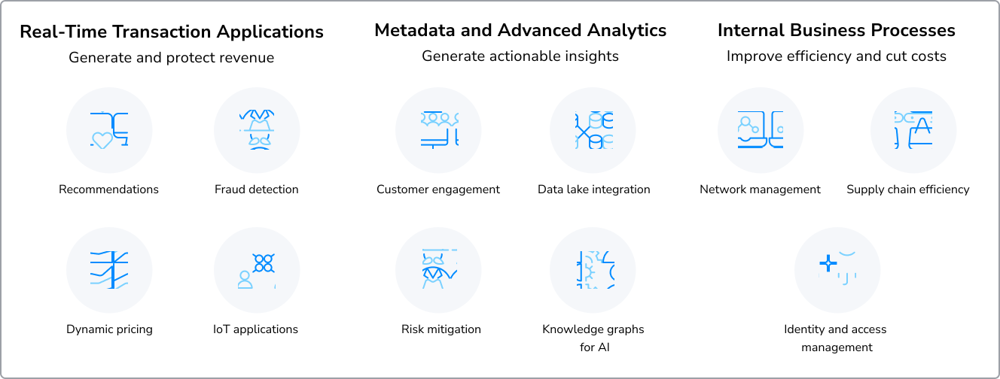

# Week 9 Overview
This week, we will analyze the origins, fundamentals, and real-world applications of graph databases (graphDB), exploring the architecture and advantages through historical context and use cases. We will also differentiate wide-column databases from other NoSQL (not only SQL) databases, examining their structure, key features, and ideal scenarios for implementation.

## Topic Overview: GraphDB: Origins, Fundamentals, and Use Cases
In this topic, we will review the evolution, architecture, and key features of graphDB, tracing its origins from graph theory and the Seven Bridges of Königsberg problem. We will also explore its real-world applications and growing popularity, highlighting its advantages in handling complex relationships and connected data.

### 1.1 Lesson: History and Evolution of GraphDB
Some of the most complex problems in data science and data management boil down to understanding connections—how things relate, interact, and flow. What if a simple puzzle from the 18th century could reveal the key to solving them? In the following video, we learn about the Seven Bridges of Königsberg, the basis for graph theory, and a challenge that led to the insight that serves as the foundation of graphDB today.

#### The Seven Bridges of Konigsberg
From the video, we can see that the relationship of nodes and edges is a way of showing the interconnected nature of entities and the basis for modern data problems we face when we have attribute data that is constantly changing. As we progress through the week, refer to this problem as a basis of how nodes and edges relate and why the technology was developed the way it was.

### 1.2 Lesson: Architecture of GraphDB
Data isn’t just about individual points—it’s about the connections between them. As the world becomes more interconnected, the ability to model relationships efficiently is transforming how we store, query, and analyze data. In the following video, we look at how graphDBs structure data, why they excel at handling complex relationships, and the key reasons behind their growing popularity in data management.

#### GraphDBs, Their Uses, and Reasons for Their Growing Popularity
- Graph databases are gaining popularity as data becomes more interconnected.
- They are a type of **NoSQL database** that stores data as a **network of relationships**.
- Unlike relational databases (which use tables), graph databases use **nodes** and **edges** to represent data.

**Key Components**
- **Nodes**: Represent entities (e.g., people, products, locations).
- **Edges**: Represent relationships between nodes (e.g., friend of, purchased, located in).
- **Properties**: Both nodes and edges can have key-value pairs that provide context (e.g., name, age, purchase date).

**Popular Graph Databases**
- **Neo4j**
- **Amazon Neptune**
- **Azure Cosmos DB** (with Gremlin API)

**Why Use Graph Databases?**
- Efficient for **traversing relationships** (critical for modern apps).
- Handle **many-to-many relationships** without performance issues.
- **Schema-agnostic**: Can evolve without predefined structure.
- **Scales horizontally**: Suitable for large, distributed systems.
- Ideal for **real-time analysis** (e.g., fraud detection, recommendations).

**Use Cases**
1. **Social Networks**
   - Platforms like Facebook & LinkedIn use graphs to model relationships (friends, followers, etc.).
   - Neo4j is often used for managing these connections.

2. **Recommendation Engines**
   - Used by companies like Netflix to recommend content.
   - Graphs help identify similar user preferences and content interactions.

3. **Knowledge Graphs**
   - Enhance search engines & assistants by connecting people, places, and things.
   - Example: Google's Knowledge Graph improves search results.
   - Microsoft Graph integrates data across Teams, OneDrive, SharePoint for personalization.

4. **Fraud Detection**
   - Graphs reveal patterns across transactions and user behavior in real-time.

**Why They're Growing in Popularity**
- Outperform relational databases in handling **complex, interconnected data**.
- Support **real-time queries** and **evolving data models**.
- Critical for **AI and ML** applications requiring deep relationship analysis.

**Summary**
- **Graph databases** are rising in use due to their strengths in:
  - Modeling complex relationships
  - Flexible data structures
  - Real-time, relationship-driven querying
- **Use cases**: Social networks, recommendations, fraud detection, knowledge graphs.

GraphDBs are a powerful alternative to relational databases, designed to handle highly interconnected data efficiently. Unlike traditional relational databases, which store information in tables, graphDBs use nodes and edges to model relationships between data points. Nodes represent entities (such as people, products, or locations), while edges define the relationships between them (e.g., “friend of,” “purchased,” or “located in”). Both nodes and edges can have properties, adding contextual details like names, purchase history, or timestamps. This structure makes graphDBs highly efficient for queries involving complex relationships and traversals across datasets. 

Popular graphDBs include Neo4j, Amazon Neptune, and Azure Cosmos DB (Gremlin API), which power applications like social networks, recommendation engines, and knowledge graphs. Social media platforms such as Facebook and LinkedIn leverage graphDBs to map user connections and suggest new interactions. Similarly, Netflix and Amazon use graph-based recommendation engines to analyze relationships between users and content preferences, providing personalized suggestions. Google’s Knowledge Graph enhances search results by connecting related entities, and Microsoft’s graph-powered data structure across Teams, SharePoint, and OneDrive helps personalize enterprise solutions with AI-driven insights. 

One of the primary reasons for the growing adoption of graphDBs is their ability to handle complex relationships efficiently. Traditional relational databases struggle with many-to-many relationships, often requiring join tables and complex queries, whereas graphDBs can retrieve relationship data in real time with minimal overhead. Additionally, they offer schema flexibility, allowing for the evolution of data models without requiring structural modifications, unlike rigid relational databases. 

GraphDBs also excel in real-time analysis. They are widely used for fraud detection, cybersecurity, and network analysis, where detecting suspicious connections and anomalies is crucial. With the rise of artificial intelligence (AI) and machine learning, graphDBs are increasingly adopted for knowledge representation, natural language processing, and AI-driven analytics, where understanding the context and relationships within vast datasets is key. 

While graphDBs offer significant advantages, they also come with trade-offs. They are not one-size-fits-all solutions; for high-volume transactional applications requiring strict atomicity, consistency, isolation, and durability (ACID) compliance, relational databases may still be preferable. Additionally, performance depends on the size and complexity of the graph, and indexing strategies must be optimized to maintain efficiency.

#### Neo4j - What is a Graph Database?
A Neo4j graph database stores data as nodes, relationships, and properties instead of in tables or documents. This means you can organize your data in a similar way as when sketching ideas on a whiteboard.

And since graph databases are not restricted to a pre-defined model, you can take more flexible approaches and strategies when working with them.

**How it Works** 
Graph databases are structured through nodes and relationships

**Nodes** are entities in the graph, which can:
- Be tagged with the labels representing their different roles in a domain (e.g, `person`)
- Hold any number of key-value pairs as properties (e.g., `name`)
- Be indexed and bound by constraints

**Relationships** provided named connections between two nodes (e.g., `Person` -> `LOVES` -> `Person`)
- Must always have a start node, an end node, and exactly one type.
- Must have a direction.
- Can have properties, like nodes.
- Nodes can have multiple relationships of various types without sacrificing performance.

In summary, nodes and relationships are an efficient and flexible way to store data since they allow you to:
- Create traversals in big graphs for both depth and breadth.
- Scale-up your database to billions of nodes.
- Design flexible property graph data models that can adapt over time.

**Why use a graph database?**
Projects often deal with large amounts of complex data and graph databases can be a powerful tool.

There are other ways to store data as objects and connections, such as relational databases, for example. However, relational databases use computing-wise expensive `JOIN` operations or cross-looks, which are often tied to a rigid data model.

Graph databases do not use JOINs. Rather, relationships are stored natively alongside the data elements (nodes) in a more flexible format, which allows the optimization of data traversing and millions of connections to be accessed per second.

Moreover, many daily challenges and tasks can be viewed from a graph perspective as it allows you to:
- Navigate deep hierarchies.
- Find hidden connections between distant items.
- Discover inter-relationships between items.

### Lesson 1.3: Advantages of GraphDB
GraphDBs are designed to efficiently store, query, and analyze highly interconnected data by leveraging a node-and-edge structure instead of traditional rows and columns. Unlike relational databases, which struggle with complex many-to-many relationships, graphDBs excel at representing and traversing relationships between data points. Each node represents an entity (such as a person, product, or location), while edges define the relationships between them (such as “friend of,” “purchased,” or “located in”). These relationships can be bidirectional and weighted, making graphDBs particularly useful in applications requiring deep relationship analysis. 

One of the biggest advantages of graphDBs is their high query efficiency for complex relationships. In relational databases, retrieving connected data often requires multiple JOIN operations, which can significantly slow down performance as datasets grow. In contrast, graphDBs use index-free adjacency, meaning they store relationships alongside data. This allows them to traverse connections quickly, making them ideal for real-time queries such as social network analysis, fraud detection, and recommendation engines. 

Another key benefit is schema flexibility. Unlike traditional relational databases that require predefined schemas, graphDBs are schema-agnostic, allowing data structures to evolve without requiring major redesigns. This makes them particularly scalable for use cases like AI-driven knowledge graphs, IoT (internet of things) networks, and supply chain management, where relationships frequently change. Additionally, many graphDBs support horizontal scaling, enabling organizations to distribute data across multiple servers efficiently. 

Finally, graphDBs are increasingly important in AI, machine learning, and cybersecurity applications. Their ability to detect patterns, uncover hidden relationships, and perform real-time analytics makes them a powerful tool for identifying fraud, detecting security threats, and improving personalized experiences. As data becomes more interconnected, graphDBs continue to gain traction as a foundational technology for modern, relationship-driven applications.

#### Using GraphDBs vs Relational Databases
Relational databases (SQL-based) and graphDBs (graph query language (GQL)-based) serve different data management needs. SQL databases store structured data in tables with predefined schemas, enforcing relationships using primary and foreign keys. They excel at handling structured, transactional data with strong ACID compliance but struggle with complex relationships due to costly JOIN operations. SQL is ideal for applications like financial systems, inventory management, and customer databases. 

GraphDBs, on the other hand, represent data as nodes and edges, making relationship queries much faster. GQL simplifies traversing complex relationships without the need for joins. GraphDBs are schema-flexible, scalable, and optimized for connected data, making them well-suited for social networks, recommendation engines, and fraud detection. However, they may lack the maturity and tooling of traditional SQL databases and are not always ideal for strictly tabular data. 

**When to Choose SQL vs GQL**
- Use SQL for structured data, transactional consistency, and tabular queries. 
- Use GQL when relationships are central to the data model and require fast traversal. 
- Hybrid approaches are increasingly common, leveraging both for different needs. 

Ultimately, the best choice depends on the complexity of relationships, scalability needs, and the flexibility required in data modeling.

### Lesson 1.4: Applications of GraphDB
GraphDBs are designed to efficiently manage and query highly connected data, making them ideal for industries and applications that rely on relationships between data points. Below are some key real-world use cases where graphDBs provide significant advantages. Do any of these examples tie to the work you’re doing? Could you apply them to a situation where perhaps a traditional RDBMS (relational database management system) is being used and a graphDB might make things more efficient? 

#### Social Networks and Relationship Management
GraphDBs are at the core of social networking platforms like Facebook, LinkedIn, and Twitter, where relationships between users (friendships, followers, connections) are as important as the users themselves. By leveraging nodes (users) and edges (relationships), social media platforms can: 
- Recommend friends or connections based on mutual relationships. 
- Analyze user engagement to improve content recommendations. 
- Detect social circles and community structures. 

#### Recommendation Engines
E-commerce platforms like Amazon, eBay, and Netflix use graphDBs to build recommendation engines by analyzing relationships between: 
- Users and products (e.g., “customers who bought this also bought that”). 
- Users and content preferences (e.g., movie recommendations based on watch history). 
- Products and categories (e.g., suggesting related items based on previous purchases). 

By efficiently traversing relationships, graphDBs enhance personalization and improve customer engagement. 

#### Fraud Detection and Cybersecurity
Financial institutions and cybersecurity firms rely on graphDBs to detect fraud and security threats by mapping connections between transactions, users, and devices. For example: 
- Banks use graph-based fraud detection to identify suspicious transaction patterns. 
- Cybersecurity teams use graph analytics to trace attack paths and identify malicious actors. 
- Companies like PayPal leverage graph technology to prevent fraudulent transactions in real time. 

#### Supply Chain and Logistics Optimization
GraphDBs help optimize supply chains by mapping relationships between suppliers, manufacturers, warehouses, and distributors. They enable: 
- Route optimization for delivery networks (e.g., optimizing shipping routes based on traffic and weather). 
- Inventory tracking by visualizing dependencies in real-time. 
- Supplier risk assessment by analyzing supplier relationships and historical performance. 

Companies like UPS and FedEx use graphDBs to improve logistics and efficiency. 

#### Knowledge Graphs and Enterprise Search
Organizations like Google, Microsoft, and IBM build knowledge graphs to improve search results and AI-driven insights. Knowledge graphs link data across different domains to: 
- Provide more relevant search engine results (Google Knowledge Graph). 
- Enhance customer support with AI-powered chatbots (Microsoft Graph). 
- Improve internal enterprise search capabilities (IBM Watson). 

By connecting disparate data sources, knowledge graphs enhance decision-making and information retrieval. 

#### Health Care and Life Sciences
GraphDBs are transforming health care and medical research by analyzing relationships between patients, diseases, treatments, and genetics. Key applications include: 
- Drug discovery by mapping interactions between drugs, proteins, and genes. 
- Patient care recommendations based on medical history and disease relationships. 
- Contact tracing and pandemic analysis, as seen in COVID-19 response efforts. 

For example, pharmaceutical companies use graphDBs to model disease pathways and accelerate drug research. 

#### Financial Services and Anti-Money Laundering (AML) 
Banks and regulatory agencies use graphDBs to track money-laundering networks and suspicious transactions. By analyzing financial records and customer connections, they can: 
- Detect money laundering patterns across accounts. 
- Identify shell companies used for fraudulent activities. 
- Ensure regulatory compliance with financial laws. 

Financial institutions like JP Morgan and HSBC leverage graphDBs to improve risk management. 

#### Telecommunications and Network Management 
Telecom companies use graphDBs to model network infrastructure, customer relationships, and service dependencies. Benefits include: 
- Optimizing call routing and minimizing service disruptions. 
- Analyzing customer churn by identifying at-risk customers. 
- Enhancing fraud prevention by detecting SIM card cloning and subscription fraud. 

Companies like AT&T and Verizon use graph-based solutions to manage large-scale network operations. 

As you can see from these examples, graphDBs provide a powerful and flexible way to manage highly connected data. From social networks and recommendation engines to fraud detection and supply chain optimization, their ability to handle complex relationships at scale makes them invaluable across industries. As businesses continue to rely on real-time analytics, AI-driven insights, and interconnected data, graphDBs will play an increasingly crucial role in modern data infrastructure.

### Topic 1: Knowledge Check
1. A major social networking platform is looking for a database solution that efficiently manages user connections and interactions. Which feature of graph databases makes them particularly suitable for this task?
- Their ability to traverse relationships quickly and efficiently
- Graph databases are designed to handle complex relationships by connecting entities (nodes) with edges, making them ideal for social networks where relationships between users (friends, followers, interactions) are key to functionality.
2. A financial institution wants to enhance its fraud detection system. How can a graph database improve fraud detection compared to a traditional relational database?
- By mapping transaction relationships across multiple accounts to detect suspicious patterns
- Graph databases excel at identifying fraudulent patterns by analyzing connections between transactions, accounts, and individuals in real -time, uncovering hidden relationships that relational databases struggle to detect efficiently. 
3. A logistics company needs to optimize delivery routes by analyzing real-time traffic conditions and warehouse locations. Why would a graph database be a good choice for this scenario?
- Graph databases can model geographical locations as nodes and traffic paths as edges, optimizing route selection dynamically
- Graph databases allow for efficient modeling of transportation networks by representing locations as nodes and routes as edges, enabling real-time optimization of logistics and delivery operations.
4. A health care organization is researching disease pathways and genetic interactions to support precision medicine. How can a graph database benefit this use case?
-  By creating highly connected networks of genetic, drug, and disease relationships for better analysis
- Graph databases enable researchers to analyze complex relationships between genes, diseases, and treatments, supporting advancements in drug discovery and personalized medicine.

## Topic 2: Wide Column Databases
In this topic, we will examine the architecture of wide-column databases, understanding how they store and manage data differently from other NoSQL databases. We will compare their unique structure, key features, and advantages, highlighting scenarios where they provide optimal performance. Finally, we will explore real-world applications and use cases.

### 2.1 Lesson: Architecture of Wide Column Databases
Wide-column databases are a type of NoSQL database designed for handling vast amounts of structured and semi-structured data across distributed systems. Unlike relational databases that store data in rows within fixed schemas, wide-column databases organize data into column families, where each row can have a unique set of columns. This structure allows for more flexible and scalable storage, accommodating evolving data models without requiring costly schema migrations. The key advantage of this model is its ability to store and retrieve large datasets efficiently while maintaining low latency. 

The architecture of a wide-column database is highly decentralized and distributed, meaning data is spread across multiple nodes in a cluster to ensure fault tolerance and high availability. Instead of relying on a central server, data is partitioned and replicated across nodes, making it resilient to hardware failures. This distribution mechanism also allows for linear scalability, meaning additional nodes can be added seamlessly to increase storage capacity and processing power. 

To optimize performance, wide-column databases utilize partitioning and indexing strategies that allow queries to locate and retrieve relevant data efficiently. For example, Apache Cassandra uses a partition key to distribute data across nodes, ensuring that related data stays together for efficient reads and writes. Additionally, tunable consistency models enable applications to strike a balance between strong consistency and eventual consistency, providing flexibility based on the use case. These design choices make wide-column databases ideal for real-time analytics, large-scale data warehousing, and applications requiring high-speed read and write operations.

### 2.2 Lesson: Why Wide-Column  Databases are Unique
Wide-column databases are unique among NoSQL databases because they provide a hybrid approach between relational and NoSQL models. While they allow for massive scalability and schema flexibility like other NoSQL databases, they also retain some structured data characteristics that make querying more efficient. Unlike key-value stores, which only allow simple key-value lookups, wide-column databases provide grouped column storage, allowing for more optimized querying of specific subsets of data. 

One of the key aspects that sets wide-column databases apart is column-family storage. In relational databases, all rows contain the same columns, but in wide-column databases, each row can have a different set of columns, eliminating the need for NULL values in unused columns. This makes them ideal for applications where data structures evolve over time or where different records require different attributes. For example, an IoT system tracking sensors may need different attributes depending on the sensor type—one might record temperature and humidity, while another might track speed and direction. 

Another defining characteristic of wide-column databases is their ability to process analytical workloads efficiently while supporting transactional queries. Unlike document stores like MongoDB, which store entire JavaScript object notation (JSON) documents, wide-column databases allow for fine-grained control over how data is stored and accessed. This makes them particularly useful for applications that require high read and write throughput, such as real-time recommendation systems, customer analytics, and financial transaction processing.

### 2.3: Advantages of Wide-column Databases
Imagine trying to organize a massive library — not by rows of books on shelves but by grouping similar topics together for instant access. That’s the power of wide-column databases. You’ve already explored their unique architecture and what sets them apart from traditional databases. In the following video, we take a deeper dive into their core features, why they scale so effectively, and where they can be impactful in real-world applications.

#### Exploring Key Features of Wide-column Databases
- Wide-column databases are a type of **NoSQL database** designed for handling **large-scale datasets** with **high availability** and **flexibility**.
- They are optimized for applications requiring **massive data storage** and **quick query access**.
- Also known as **column-family stores**.

**Key Concepts**
- Data is stored **by columns** (not rows like in relational databases).
- Ideal for **analytical queries** and applications with **high write throughput**.
- Each **row can have a different number of columns**.
- Related columns are grouped into **column families**, improving read/write performance.

**Popular Wide-Column Databases**
- **Apache Cassandra**
- **HBase**
- **Google BigTable**

**Core Features**
**Column Family Storage Model**
- Data organized into **tables** and **column families**.
- Each column family contains data for a specific use case.
- Rows can vary in structure (different columns per row).
- Example: In e-commerce—
  - One column family for **customer details**
  - Another for **transaction data**

**Horizontal Scalability & Partitioning**
- Designed to **scale horizontally** by adding more servers.
- **Partitioning** spreads data across multiple nodes.
- Enhances both **storage capacity** and **query speed**.
- Example: Apache Cassandra uses a **partition key** to distribute data evenly.

**Flexible Data Model (Schema-Optional)**
- No strict schema required; **schema can evolve over time**.
- Each row can contain a **different set of columns**.
- Useful in applications with **varying data formats**, such as IoT systems.

**High Availability & Fault Tolerance**
- Built-in **replication** across nodes ensures **redundancy**.
- Supports **eventual consistency** for high performance and reliability.
- Designed to **stay online** even during hardware failures.

**Use Cases**
1. **Time Series Data**
   - Efficiently stores and queries data collected over time (e.g., sensor logs).
2. **Real-Time Analytics**
   - Processes large data volumes in real time (e.g., user activity monitoring).
3. **IoT Applications**
   - Manages varied data from smart devices (e.g., smart home or industrial sensors).

**Summary**
- Wide-column databases are ideal for:
  - **Massive data handling**
  - **Flexible, schema-less designs**
  - **High scalability and availability**
- Their column-oriented storage model, combined with **horizontal scaling** and **fault tolerance**, makes them perfect for **big data** and **real-time analytics** workloads.

Wide-column databases offer several powerful features that make them well-suited for large-scale, distributed applications. One of the primary features is high availability and fault tolerance, achieved through automatic data replication across multiple nodes. This ensures that data remains accessible even in the event of node failures, making these databases highly resilient to infrastructure issues. 

Another major advantage is schema flexibility, allowing developers to add, remove, or modify columns dynamically without restructuring existing data. This is especially useful in applications with evolving requirements, where new fields may need to be introduced frequently. Additionally, because columns are stored in groups rather than rows, queries can retrieve only the necessary data without scanning unnecessary columns, significantly improving performance. 

Performance optimization is another key feature of wide-column databases. They are designed to handle both write-heavy and read-heavy workloads efficiently. Features like partitioning and clustering enable data to be stored in an optimized format for faster retrieval, reducing query latency. Furthermore, tunable consistency models allow businesses to choose between strong consistency (ensuring every read gets the latest write) or eventual consistency (allowing for temporary inconsistencies for faster processing). This balance is critical for industries like banking, retail, and telecommunications, where different operations may require different levels of consistency.
 
 ### 2.4 Lesson: Applications of Wide-Column Databases
 Wide-column databases are widely used across industries that require scalability, high-speed data processing, and real-time analytics. One of the most well-known applications is in time-series data storage, where each row represents an event occurring at a specific time. Industries such as IoT, finance, and cybersecurity rely on wide-column databases to efficiently store and analyze massive amounts of time-stamped data. 

Another major use case is real-time analytics and recommendation engines. Companies like Netflix and Amazon leverage wide-column databases to analyze user behavior and provide personalized recommendations. These databases allow for fast retrieval of customer interactions, ensuring that recommendations are updated dynamically based on the latest user activity. The ability to quickly query large datasets makes wide-column databases a preferred choice for advertising platforms, fraud detection systems, and social media analytics. 

Telecommunications companies also use wide-column databases for storing call detail records (CDRs) and managing large-scale infrastructure monitoring. The ability to process billions of records across distributed nodes ensures that telecom providers can efficiently handle network usage data, detect anomalies, and optimize service delivery. Similarly, financial institutions use wide-column databases to track transactions, monitor risk, and ensure compliance with real-time fraud detection mechanisms.
